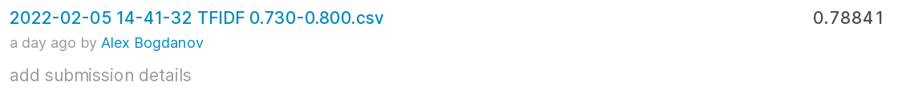
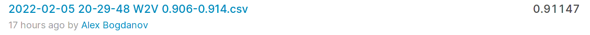

# Структура репозитория

- [cli/](https://github.com/SphericalPotatoInVacuum/intro-to-dl-hse/tree/main/homeworks/homework-03-text/cli)
Тут лежат сорцы всех регрессоров и вспомогательных функций.

- [data/](https://github.com/SphericalPotatoInVacuum/intro-to-dl-hse/tree/main/homeworks/homework-03-text/data)
Тут лежат данные и сюда же сохраняются результаты препроцессинга.

- plots/
(Создаётся автоматически)
Сюда сохраняются графики зависимости лосса от параметров, если мы их перебираем.

- predictions/
(Создаётся автоматически)
Сюда сохраняются предикшены для теста.

- Dockerfile
Не знаю зачем, я его сделал просто чтобы оттестить, что в requirements.txt есть
всё, что нужно. Как аргумент запуска принимает цель для Makefile
(при отсутствии запускает все цели).

- Makefile Содержит цели для процессинга данных (process) и всех регрессоров
(tfidf, w2v, ft, bert)

- text.py Реализует CLI для взаимодействия с домашкой :D

# Как проверить, что всё запускается

## Docker

У `text.py` реализовано две команды: `preprocess` и `train`. Первая используется
для препроцессинга данных (неожиданно), вторая нужна для обучения регрессора
и предсказания рейтингов на тестовом датасете.

Для удобства есть докер образ [sphericalpotatoinvaccum/dl-hw3](https://hub.docker.com/repository/docker/sphericalpotatoinvacuum/dl-hw3),
который стоит пускать примаунтив папку с домашкой в папку `app` внутри контейнера:
```
docker run --rm -it -v "$(pwd):/app" -t dl-3 <цель Makefile>
```

## Makefile

`make {tfidf | w2v | ft | bert}` запустит обучение соответствующего регрессора.
Всё то же самое можно сделать ручками.

## Ручками

`text.py` реализует две команды: `preprocess` и `train`. Везде доступна спарвка 
с `--help`.

### `preprocess`

Команда принимает два аргумента: csv файл с данными, и файл, куда она дампнет
запикленые данные после процессинга.

### `train`

Команда принимает один аргумент: название модели, которую будем обучать.
Сгенерированные предикшены для тестовых данных сохраняются в папку `predictions`,
а если внутри происходит перебор параметров по сетке, то график сохраняется в 
`plots`.

# Собственно домашка (выводы и прочее)

## Часть 0

Для предобработки текста я токенизировал его, вырезал всю пунктуацию, удалил стоп слова,
не несущие смысловой нагрузки, а потом жахнул стеммером. И удалил редкие, чтобы не мешались.

## Часть 1

Ну тут нечего бухтеть, tfidf разнёс:



## Часть 2

Это самое отвратительное, что я делал за последнее время. Почему это весит только 2 балла?

На средних векторах у меня было всё очень грустно на валидации в итоговой модели,
предлагаю сразу перейти к версии с использованием idf:



Эксперименты с размерностью эмбеддинга (честно скажу, что обучал на 20% датасета,
потому что было лень ждать, но тут вроде и так видно всё):


### Выводы

Word2Vec какашка, еле еле обучил. FastText отыграл ещё хуже. Чем больше размерность
вектора, тем лучше, но после 1000 улучшений не было.

## Часть 3

Я, если честно, даже не знаю что тут писать. Взял претрейнутого берта на классификацию
одного класса и этот единственный выход использовал как таргет. Файнтюнил
1 эпоху. Стартовал с lr=1e-4, потом шедулером уменьшал в 2 раза, если за 5000 элементов
не было улучшений. Выходы токенайзера обрезал до 100, паддил до максимального выхода
внутри батча. Результаты на скриншоте:


